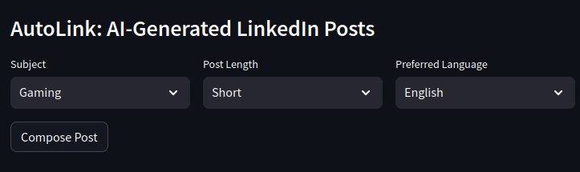

# AutoLink: AI-Generated LinkedIn Posts

This tool allows LinkedIn influencers to generate new posts based on the writing style of their past posts. By analyzing past posts, it extracts key topics, styles, and other relevant attributes to craft posts that align with the user's established tone and style.



## Overview

For example, if **Ananya**, a LinkedIn influencer, wants help creating future posts, she can feed her past LinkedIn posts into this tool. The tool will analyze the posts, extracting key topics, language preferences, and length. Ananya can then select the desired topic, language, and post length, and the tool will generate a new post that mirrors her writing style.

## Features

- Analyze past LinkedIn posts to extract key topics, writing styles, and preferences.
- Generate new posts based on selected topics, writing styles, language, and length.
- Supports four languages: **English**, **Hinglish**, **Hindi**, and **Assamese**.
- Uses few-shot learning to guide the model based on past posts related to the selected topic, language, and length.
- Powered by the **Llama-3.3-70B Versatile** model for generating content.

## Set-up Instructions

### Prerequisites:
1. **API Key**: To access the required API, you'll need to get an API key.
   - Visit [Groq Console](https://console.groq.com/keys) to get your `API_KEY`.
   - Update the `.env` file with the API key by setting `GROQ_API_KEY` to your generated key.

### Installation:
1. Install the required dependencies:
    ```bash
    pip install -r requirements.txt
    ```

2. Run the Streamlit app:
    ```bash
    streamlit run main.py
    ```

   This will launch the Streamlit application, and you can interact with the tool through your browser.

## Usage
1. Feed your past LinkedIn posts into the tool to let it analyze your writing style and topics.
2. Select the **Topic**, **Language**, and **Post Length** for your new post.
3. Click the **Generate** button to create a new post based on the selected parameters and your past posts.

### Supported Languages:
- **English**
- **Hinglish**
- **Hindi**
- **Assamese**